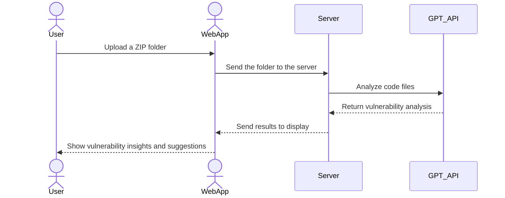

# Code Vulnerability Analyzer

[My Notes](notes.md)

A web application that allows users to upload a folder of code (e.g., as a ZIP file), analyzes it using the OpenAI GPT API, and provides insights into potential vulnerabilities and suggestions for improvement. This tool is designed to streamline the process of securing codebases by leveraging the latest AI technologies.

## 🚀 Specification Deliverable

For this deliverable I did the following. I checked the box `[x]` and added a description for things I completed.

- [x] Proper use of Markdown
- [x] A concise and compelling elevator pitch
- [x] Description of key features
- [x] Description of how you will use each technology
- [x] One or more rough sketches of your application. Images must be embedded in this file using Markdown image references.

### Elevator pitch

Code Vulnerability Analyzer is a user-friendly web tool that enables developers to proactively identify and resolve security vulnerabilities in their codebases. By uploading a folder containing their code, users receive detailed reports generated using AI, highlighting weaknesses and providing actionable recommendations for improvement. Whether you're working on a small project or a large-scale application, this tool ensures your code meets high-security standards.

### Design

Below is a conceptual design of the application's workflow:
1. Users upload a compressed folder of their code.
2. The server extracts the contents and processes each file.
3. The OpenAI GPT API is used to analyze the files for vulnerabilities.
4. Results are displayed on an interactive dashboard.

### Key features

- Secure Upload: Users can upload a compressed folder containing their codebase securely.
- AI-Powered Analysis: The application integrates with the OpenAI GPT API to analyze the code for common vulnerabilities, such as SQL injection, XSS, and weak encryption.
- Detailed Reports: Generates actionable suggestions for improving code security.
- Interactive Dashboard: Allows users to explore vulnerabilities file by file, with severity ratings and improvement tips.
- Real-Time Feedback: Uses WebSocket to show the progress of analysis as it happens.

### Technologies

I am going to use the required technologies in the following ways.

HTML:
Used for structuring the web application's UI, including forms for uploading files and displaying analysis results.
CSS:
Ensures the application is visually appealing and provides a responsive design for various devices.
Includes styling for the dashboard, progress indicators, and vulnerability highlights.
React:
Manages the dynamic, component-based front-end for file uploads, real-time analysis progress, and report displays.
Handles routing for navigation between pages (e.g., upload page, results page).
Service:
Integrates the OpenAI GPT API for analyzing code files.
Uses third-party libraries for handling ZIP file uploads and extraction.
DB/Login:
Implements user authentication for secure access to the application.
Stores user-uploaded files and analysis history in a database for reference.
WebSocket:
Provides real-time feedback to users during the analysis process, such as displaying progress and results as they are generated.

- **HTML** - Description here
- **CSS** - Description here
- **React** - Description here
- **Service** - Description here
- **DB/Login** - Description here
- **WebSocket** - Description here

## 🚀 AWS deliverable

For this deliverable I did the following. I checked the box `[x]` and added a description for things I completed.

- [ ] **Server deployed and accessible with custom domain name** - [My server link](https://yourdomainnamehere.click).

## 🚀 HTML deliverable

For this deliverable I did the following. I checked the box `[x]` and added a description for things I completed.

- [ ] **HTML pages** - I did not complete this part of the deliverable.
- [ ] **Proper HTML element usage** - I did not complete this part of the deliverable.
- [ ] **Links** - I did not complete this part of the deliverable.
- [ ] **Text** - I did not complete this part of the deliverable.
- [ ] **3rd party API placeholder** - I did not complete this part of the deliverable.
- [ ] **Images** - I did not complete this part of the deliverable.
- [ ] **Login placeholder** - I did not complete this part of the deliverable.
- [ ] **DB data placeholder** - I did not complete this part of the deliverable.
- [ ] **WebSocket placeholder** - I did not complete this part of the deliverable.

## 🚀 CSS deliverable

For this deliverable I did the following. I checked the box `[x]` and added a description for things I completed.

- [ ] **Header, footer, and main content body** - I did not complete this part of the deliverable.
- [ ] **Navigation elements** - I did not complete this part of the deliverable.
- [ ] **Responsive to window resizing** - I did not complete this part of the deliverable.
- [ ] **Application elements** - I did not complete this part of the deliverable.
- [ ] **Application text content** - I did not complete this part of the deliverable.
- [ ] **Application images** - I did not complete this part of the deliverable.

## 🚀 React part 1: Routing deliverable

For this deliverable I did the following. I checked the box `[x]` and added a description for things I completed.

- [ ] **Bundled using Vite** - I did not complete this part of the deliverable.
- [ ] **Components** - I did not complete this part of the deliverable.
- [ ] **Router** - Routing between login and voting components.

## 🚀 React part 2: Reactivity

For this deliverable I did the following. I checked the box `[x]` and added a description for things I completed.

- [ ] **All functionality implemented or mocked out** - I did not complete this part of the deliverable.
- [ ] **Hooks** - I did not complete this part of the deliverable.

## 🚀 Service deliverable

For this deliverable I did the following. I checked the box `[x]` and added a description for things I completed.

- [ ] **Node.js/Express HTTP service** - I did not complete this part of the deliverable.
- [ ] **Static middleware for frontend** - I did not complete this part of the deliverable.
- [ ] **Calls to third party endpoints** - I did not complete this part of the deliverable.
- [ ] **Backend service endpoints** - I did not complete this part of the deliverable.
- [ ] **Frontend calls service endpoints** - I did not complete this part of the deliverable.

## 🚀 DB/Login deliverable

For this deliverable I did the following. I checked the box `[x]` and added a description for things I completed.

- [ ] **User registration** - I did not complete this part of the deliverable.
- [ ] **User login and logout** - I did not complete this part of the deliverable.
- [ ] **Stores data in MongoDB** - I did not complete this part of the deliverable.
- [ ] **Stores credentials in MongoDB** - I did not complete this part of the deliverable.
- [ ] **Restricts functionality based on authentication** - I did not complete this part of the deliverable.

## 🚀 WebSocket deliverable

For this deliverable I did the following. I checked the box `[x]` and added a description for things I completed.

- [ ] **Backend listens for WebSocket connection** - I did not complete this part of the deliverable.
- [ ] **Frontend makes WebSocket connection** - I did not complete this part of the deliverable.
- [ ] **Data sent over WebSocket connection** - I did not complete this part of the deliverable.
- [ ] **WebSocket data displayed** - I did not complete this part of the deliverable.
- [ ] **Application is fully functional** - I did not complete this part of the deliverable.
