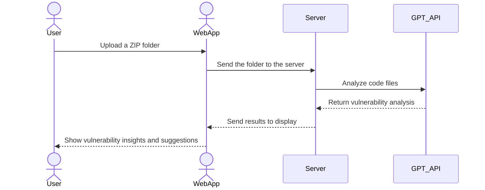

# Free Secure Code

[My Notes](notes.md)

This is a web application that allows users to upload a folder of code, analyzes it using the OpenAI GPT API, and provides insights into potential vulnerabilities and suggestions for improvement. This tool is designed to implement simple, fast, and secure code analyisis using the latest AI technologies.

## 🚀 Specification Deliverable

For this deliverable I did the following. I checked the box `[x]` and added a description for things I completed.

- [x] Proper use of Markdown
- [x] A concise and compelling elevator pitch
- [x] Description of key features
- [x] Description of how you will use each technology
- [x] One or more rough sketches of your application. Images must be embedded in this file using Markdown image references.

### Elevator pitch

Have you ever wanted to know if your code is secure? Code Vulnerability Analyzer is a simple web tool that enables developers to identify and resolve security vulnerabilities in a matter of seconds. By uploading a folder containing your code, you can receive detailed AI reports, highlighting weaknesses and providing some recommendations for improvement. Whether you're working on a small project or a large-scale application, this tool ensures your code meets high-security standards.

### Design

Here is a conceptual design of the workflow:
1. Users upload a compressed folder of their code.
2. The server extracts its contents and processes each file.
3. The OpenAI GPT API is used to analyze the files for vulnerabilities.
4. Results are displayed on a dashboard.

### Key features

- Secure Upload: Users can upload a compressed folder containing their codebase securely.
- AI-Powered Analysis: The application integrates with the OpenAI GPT API to analyze the code for common vulnerabilities, such as SQL injection, XSS, and weak encryption.
- Detailed Reports: Generates actionable suggestions for improving code security.
- Dashboard: Allows users to explore vulnerabilities file by file, with severity ratings and improvement tips.
- Real-Time Feedback: Uses WebSocket to show the progress of analysis as it happens.

### Technologies

I am going to use the required technologies in the following ways.

- **HTML** - Uses correct HTML structure for application. Two HTML pages. One for login and one for the code analyzer dashboard.
- **CSS** - Application styling that looks good on different screen sizes, uses good whitespace, color choice and contrast.
- **React** - Provides login, file uploads, real-time analysis progress, and report displays.
- **Service** - Integrates the OpenAI GPT API for analyzing code files.
Uses third-party libraries for handling ZIP file uploads and extraction.
- **DB/Login** - Implements user authentication for secure access to the application.
Stores user-uploaded files and analysis history in a database for reference.
- **WebSocket** - Provides real-time feedback to users during the analysis process, such as displaying progress and results as they are generated.

## 🚀 AWS deliverable

For this deliverable I did the following. I checked the box `[x]` and added a description for things I completed.

- [X] **Server deployed and accessible with custom domain name** - [My server link](https://getsecurecode.com).

## 🚀 HTML deliverable

For this deliverable I did the following. I checked the box `[x]` and added a description for things I completed.

- [X] **HTML pages** - Built four main HTML pages for my app! Created a login page, an analyzer dashboard page, a history page, and an about page. Everything links together nicely.

- [X] **Proper HTML element usage** - Used semantic HTML throughout with headers, footers, main sections, and forms. Tried to keep it clean and accessible.

- [X] **Links** - Added navigation links between all pages. The nav bar makes it easy to jump between different sections of the app.

- [X] **Text** - Wrote up some catchy descriptions explaining what the app does and how to use each feature. Added placeholder text for the analysis results too.

- [X] **3rd party API placeholder** - Created a spot where the OpenAI-powered analysis will show up later. For now it just shows what the results might look like.

- [X] **Images** - Added a logo in the header and some placeholder images in the about section. Makes it look much more professional!

- [X] **Login placeholder** - Set up the login form with email and password fields. It doesn't authenticate yet but the structure is all there.

- [X] **DB data placeholder** - Added tables and cards in the history page to show what previous analysis results will look like once we have a database.

- [X] **WebSocket placeholder** - Created an activity log section that will eventually show real-time updates. For now it just has some example notifications.

## 🚀 CSS deliverable

For this deliverable I did the following. I checked the box `[x]` and added a description for things I completed.

- [X] **Header, footer, and main content body** - Created a clean, modern layout with a fixed header and footer. The dark-themed header really makes the logo pop!

- [X] **Navigation elements** - Styled the nav bar with hover effects and active states. It's easy to see which page you're on and the links feel nice to click.

- [X] **Responsive to window resizing** - Made everything look good on phones, tablets, and desktops. The analyzer dashboard switches from a grid to a single column on smaller screens.

- [X] **Application elements** - Added some nice styling to forms, buttons, and cards. Used a consistent color scheme of dark backgrounds with bright accents for important actions.

- [X] **Application text content** - Chose easy-to-read fonts and made sure there's enough contrast. Used different text sizes to create hierarchy and draw attention to important info.

- [X] **Application images** - Made images resize properly and added some subtle border effects. The placeholder images actually look pretty nice with the styling!

## 🚀 React part 1: Routing deliverable

For this deliverable I did the following. I checked the box `[x]` and added a description for things I completed.

- [X] **Bundled using Vite** - Set up my project with Vite and it's super fast!

- [X] **Components** - Split everything into React components! Created separate components for Login, Analyzer, History, and About pages. 

- [X] **Router** - Implemented React Router to handle navigation. Now users can move between different sections of the app without page refreshes.

## 🚀 React part 2: Reactivity

For this deliverable I did the following. I checked the box `[x]` and added a description for things I completed.

- [X] **All functionality implemented or mocked out** - Got all the core features working! The analyzer now shows a cool progress bar when "uploading" files, displays vulnerability results with colored severity indicators, and lets users see details about potential security issues. It's pretty satisfying to see it all come together.

- [X] **Hooks** - Used React hooks all over the place. useState keeps track of things like file uploads and analysis results, useEffect helps load saved data when the page opens, and useMemo makes the history sorting super fast.

## 🚀 Service deliverable

For this deliverable I did the following. I checked the box `[x]` and added a description for things I completed.

- [x] **Node.js/Express HTTP service** - Created a backend service using Express that provides authentication and code analysis endpoints.
- [x] **Static middleware for frontend** - Added Express static middleware to serve the frontend files from the public directory.
- [x] **Calls to third party endpoints** - Implemented a security news endpoint that fetches data from the HackerNews API.
- [x] **Backend service endpoints** - Created endpoints for user authentication (register, login, logout) and code analysis (submit code, get analysis, get user analyses).
- [x] **Frontend calls service endpoints** - Frontend components make fetch requests to the service endpoints for authentication and code analysis.

## 🚀 DB/Login deliverable

For this deliverable I did the following. I checked the box `[x]` and added a description for things I completed.

- [ ] **User registration** - I did not complete this part of the deliverable.
- [ ] **User login and logout** - I did not complete this part of the deliverable.
- [ ] **Stores data in MongoDB** - I did not complete this part of the deliverable.
- [ ] **Stores credentials in MongoDB** - I did not complete this part of the deliverable.
- [ ] **Restricts functionality based on authentication** - I did not complete this part of the deliverable.

## 🚀 WebSocket deliverable

For this deliverable I did the following. I checked the box `[x]` and added a description for things I completed.

- [ ] **Backend listens for WebSocket connection** - I did not complete this part of the deliverable.
- [ ] **Frontend makes WebSocket connection** - I did not complete this part of the deliverable.
- [ ] **Data sent over WebSocket connection** - I did not complete this part of the deliverable.
- [ ] **WebSocket data displayed** - I did not complete this part of the deliverable.
- [ ] **Application is fully functional** - I did not complete this part of the deliverable.
